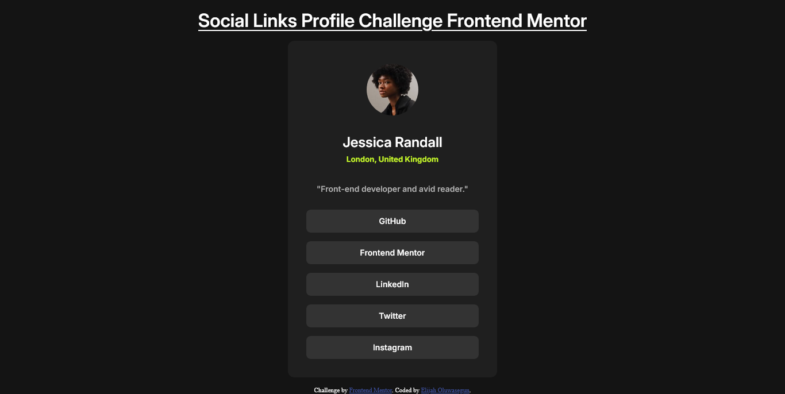
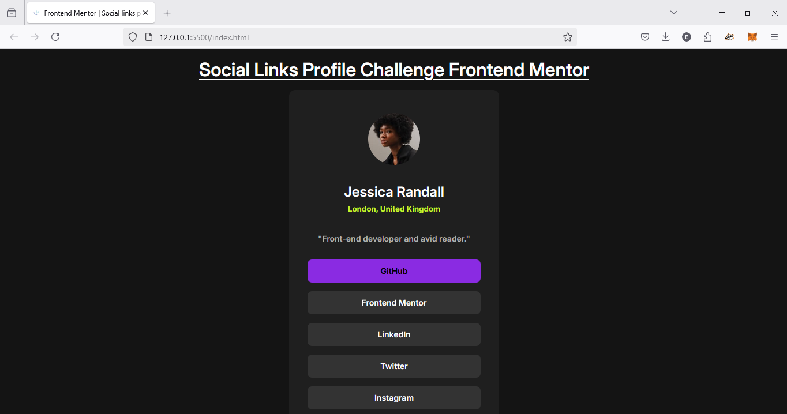
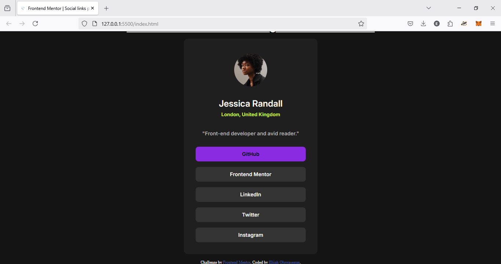
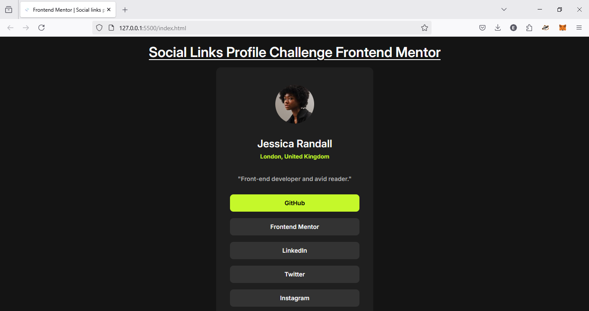
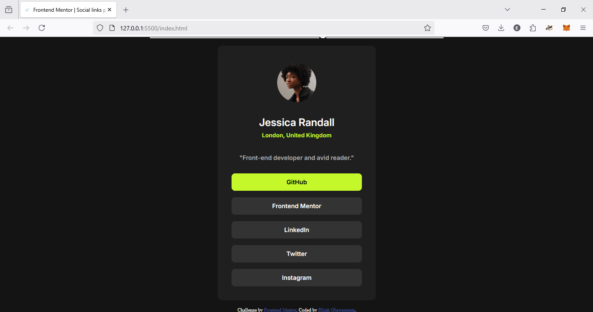
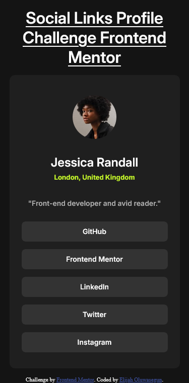
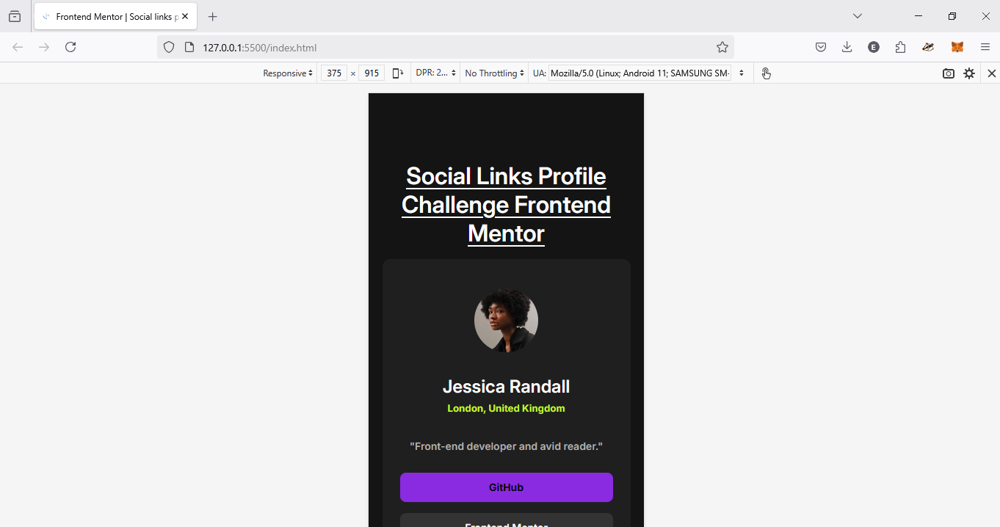
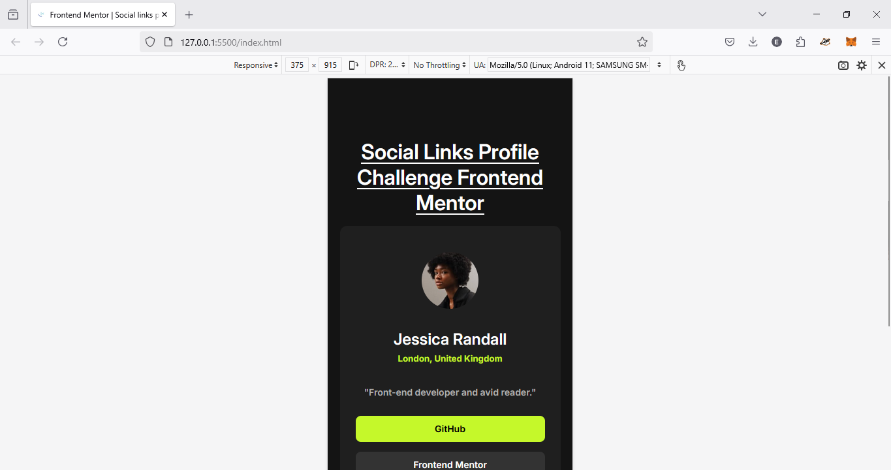

# Frontend Mentor - Social links profile solution

This is a solution to the [Social links profile challenge on Frontend Mentor](https://www.frontendmentor.io/challenges/social-links-profile-UG32l9m6dQ). Frontend Mentor challenges help you improve your coding skills by building realistic projects.

## Table of contents

- [Overview](#overview)
  - [The challenge](#the-challenge)
  - [Screenshot](#screenshot)
  - [Links](#links)
- [My process](#my-process)
  - [Built with](#built-with)
  - [What I learned](#what-i-learned)
  - [Useful resources](#useful-resources)
- [Author](#author)

## Overview

### The challenge

Users should be able to:

- See hover and focus states for all interactive elements on the page

### Screenshot

**Desktop Version**

**Desktop Version - Hover State**

**Desktop Version - Active State**

**Mobile Version**

**Mobile Version - Hover State**

**Mobile Version - Active State**

### Links

- Solution URL: [(https://github.com/ElijahOluwasegun/social-links-profile-coding-challenge)]
- Live Site URL: [(https://elijaholuwasegun.github.io/social-links-profile-coding-challenge/)]

## My process

### Built with

- Semantic HTML5 markup
- CSS custom properties
- Flexbox

### What I learned

I've gained a good understanding of HTML content structuring. My approach involved first outlining all elements and their containers, creating the essential framework for my CSS.

### Useful resources

- [Neko Calc](https://nekocalc.com/) - An valuable resource that supported me to make my solution responsive. I really liked the simplicity in using the website and recommend it to anyone trying to convert pixel or other values to a required format.
- [CSS Unit Converter](https://cssunitconverter.vercel.app/) - A valuable resources that supported me in converting css units.

## Author

- Frontend Mentor - [@ElijahOluwasegun](https://www.frontendmentor.io/profile/ElijahOluwasegun)
